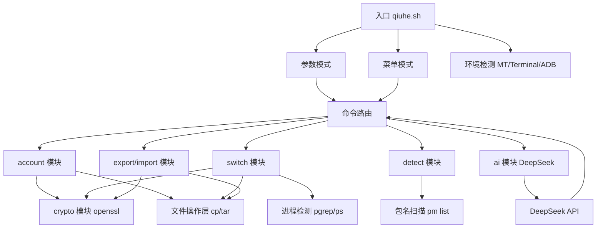

# 腾讯手游账号本地切换器

Feature Name: game-account-switcher
Updated: 2026-07-26

## 描述

一套 Android 手机端 Shell 脚本工具，支持 MT 管理器直接执行 .sh 脚本，同时提供 Magisk/KernelSU 模块封装。通过备份和替换游戏在 `/data/data/<pkg>/` 下的私有数据目录，实现腾讯手游多账号快速切换。支持 openssl 加密存档、.tar.gz 打包导入导出，以及通过 DeepSeek AI 实现自然语言账号管理。

## 架构



## 双形态交付

### 形态一：Shell 脚本（MT 管理器可执行）

单个入口 `.sh` 文件 + `lib/` 函数库目录，放置在任意目录下即可在 MT 管理器中点击执行。

### 形态二：Magisk/KSU 模块

标准 Magisk 模块 zip 包，通过 Magisk Manager 或 KSU 管理器刷入安装。

**Magisk 模块结构：**
```
清荷-module.zip
├── META-INF/com/google/android/update-binary
├── module.prop
├── customize.sh          # 安装脚本
├── uninstall.sh          # 卸载脚本
├── service.sh            # 开机服务（可选）
└── system/
    └── bin/
        └── 清荷           # 安装后全局可用命令
```

## 组件与接口

### 公共函数库 `lib/common.sh`

| 函数 | 职责 |
|------|------|
| `log_info` / `log_warn` / `log_err` | 日志输出，适配 MT/终端/ADB 环境 |
| `check_root` | 检测 root 权限，无 root 则报错退出 |
| `detect_env` | 检测运行环境类型 |
| `require_cmd` | 检查依赖命令（openssl、tar、pgrep 等） |
| `get_data_dir` | 获取脚本数据存储目录 |
| `get_game_data` | 根据包名获取游戏数据路径 |

### 账号管理模块 `lib/account.sh`

| 函数 | 职责 |
|------|------|
| `account_backup <pkg> <alias>` | 备份当前游戏数据为账号存档 |
| `account_list [pkg]` | 列出已备份账号 |
| `account_info <alias>` | 查看账号详情 |
| `account_delete <alias>` | 删除账号存档 |
| `account_restore <alias>` | 从存档恢复（即切换账号） |

### 切换引擎 `lib/switch.sh`

| 函数 | 职责 |
|------|------|
| `switch_account <alias>` | 一键切换主流程 |
| `check_game_running <pkg>` | 检测游戏进程是否运行 |
| `backup_current <pkg>` | 切换前自动备份当前数据 |
| `apply_account <alias>` | 将存档数据写入游戏目录 |
| `fix_permissions <pkg>` | 修复文件权限和 SELinux 上下文 |
| `rollback <pkg>` | 切换失败时回滚 |

**切换流程：**
```
1. check_game_running → 运行中则提示关闭
2. backup_current → 备份当前为自动快照
3. apply_account → 覆盖目标账号数据
4. fix_permissions → 修复 uid/gid/context
5. 输出结果
```

### 加密模块 `lib/crypto.sh`

| 函数 | 职责 |
|------|------|
| `crypto_encrypt <src> <dst> <pass>` | openssl aes-256-cbc 加密 |
| `crypto_decrypt <src> <dst> <pass>` | openssl aes-256-cbc 解密 |
| `tar_encrypt <dir> <output> <pass>` | tar 打包后加密 |
| `tar_decrypt <input> <output_dir> <pass>` | 解密后解包 |
| `read_pass` | 安全读取密码输入（不回显） |

### 游戏检测模块 `lib/detect.sh`

| 函数 | 职责 |
|------|------|
| `detect_games` | 扫描已安装腾讯手游 |
| `match_pkg` | 包名匹配已知游戏列表 |
| `show_data_size` | 显示游戏数据目录大小 |

### DeepSeek AI 模块 `lib/ai.sh`

通过 DeepSeek Chat API 实现自然语言驱动的账号管理。用户在 Web UI 中直接输入自然语言指令，AI 解析后自动执行对应操作。

| 函数 | 职责 |
|------|------|
| `ai_chat <prompt> [system_prompt]` | 调用 DeepSeek Chat API 进行对话 |
| `ai_parse_command <input>` | 将自然语言输入解析为 qiuhe 命令 JSON |
| `ai_status` | 查询 AI 配置状态（是否已配置 API Key） |
| `load_ai_config` | 从 `$DATA_DIR/ai.conf` 加载 API Key 和模型配置 |
| `save_ai_config <api_key>` | 保存 API Key 到配置文件 |

**API 端点（Web UI）：**

| 端点 | 方法 | 参数 | 说明 |
|------|------|------|------|
| `/api/ai/chat` | POST | `msg` | 发送消息给 AI，返回对话结果 |
| `/api/ai/config?action=get` | GET | - | 查询 API Key 配置状态 |
| `/api/ai/config?action=set` | POST | `key` | 设置 API Key |
| `/api/ai/config?action=delete` | POST | - | 清除 API Key |

**AI 命令解析流程：**
```
用户输入自然语言 → ai_chat(带命令解析 system prompt) → DeepSeek API → JSON 命令
                                                                    ↓
                                          {"cmd":"switch","game":"sgame","alias":"大号"}
                                                                    ↓
                                              switch_account("大号") 自动执行
```

**配置文件 `ai.conf` 格式：**
```sh
AI_API_KEY="sk-xxxxxxxxxxxxxxxxxxxxxxxx"
AI_MODEL="deepseek-chat"
```

**Web UI 交互方式：**
- 新增「AI 助手」Tab 页
- 聊天式对话界面，支持自然语言输入
- 快捷指令按钮（列出账号、检测游戏、切号示例）
- AI 回复中的操作命令自动解析并执行
- 设置面板配置/清除 API Key

## 数据模型

### 账号存档结构

```
{DATA_DIR}/accounts/<pkg>/<alias>/
├── meta.json          # 元数据：包名、别名、创建时间、账号标签
├── data.tar.gz.enc    # 加密的完整数据存档 (可选加密)
└── data/              # 未加密模式的直接数据副本
    ├── shared_prefs/
    ├── databases/
    ├── files/
    └── ...
```

**meta.json 格式：**
```json
{
  "package": "com.tencent.tmgp.sgame",
  "alias": "大号",
  "label": "大号-王者50星",
  "created_at": "2026-07-26 20:00:00",
  "data_size": "125M",
  "encrypted": false
}
```

### 游戏配置数据库 `lib/games.ini`

```ini
# 格式: 游戏名|包名|数据目录路径模式|需要备份的子目录(逗号分隔)

# 王者荣耀
sgame|com.tencent.tmgp.sgame|/data/data/com.tencent.tmgp.sgame|shared_prefs,databases,files

# 和平精英
pubgm|com.tencent.tmgp.pubgmhd|/data/data/com.tencent.tmgp.pubgmhd|shared_prefs,databases,files

# CF手游
cf|com.tencent.tmgp.cf|/data/data/com.tencent.tmgp.cf|shared_prefs,databases,files

# QQ飞车
speed|com.tencent.tmgp.speedmobile|/data/data/com.tencent.tmgp.speedmobile|shared_prefs,databases,files

# 使命召唤手游
cod|com.tencent.tmgp.cod|/data/data/com.tencent.tmgp.cod|shared_prefs,databases,files

# 金铲铲之战
jkchess|com.tencent.tmgp.jkchess|/data/data/com.tencent.tmgp.jkchess|shared_prefs,databases,files

# 英雄联盟手游
lolm|com.tencent.lolm|/data/data/com.tencent.lolm|shared_prefs,databases,files

# 火影忍者
kihan|com.tencent.KiHan|/data/data/com.tencent.KiHan|shared_prefs,databases,files

# 天涯明月刀
wuxia|com.tencent.tmgp.wuxia|/data/data/com.tencent.tmgp.wuxia|shared_prefs,databases,files
```

### 数据存储位置

| 环境 | 数据目录 | 特性 |
|------|---------|------|
| Magisk/KSU 模块 | `/data/清荷/` | 模块化管理，卸载可选清数据 |
| Shell 独立运行 | 脚本所在目录 `./清荷-data/` | 随脚本移动，方便迁移 |
| 用户自定义 | 通过 `QH_DATA_DIR` 环境变量指定 | 灵活存放 |

## 命令结构

```
# 备份当前游戏数据为账号
qiuhe backup <游戏名> <账号别名> [--encrypt]

# 列出所有或指定游戏的账号
qiuhe list [游戏名]

# 查看账号详情
qiuhe info <账号别名>

# 删除账号存档
qiuhe delete <账号别名>

# 切换账号
qiuhe switch <账号别名>

# 检测已安装游戏
qiuhe detect

# 导出账号
qiuhe export <账号别名> --output <路径> [--pass <密码>]
qiuhe export --all --output <目录> [--pass <密码>]

# 导入账号
qiuhe import <文件路径> [--pass <密码>]

# 查看帮助
qiuhe help
```

## 正确性属性

- 切换操作必须满足原子性：备份完成后才覆盖，覆盖失败可回滚
- 切换前自动备份当前数据，确保任何时刻最近一次数据都有存档
- 每个账号存档的 meta.json 必须与 data 目录数据一致
- SELinux 上下文修复必须正确，否则游戏可能无法读取数据

## 错误处理

| 场景 | 处理策略 |
|------|---------|
| 无 root 权限 | 提示需要 root，退出 |
| 游戏正在运行 | 提示关闭游戏后重试 |
| 目标账号不存在 | 提示可用账号列表 |
| 存储空间不足 | 检查剩余空间，不足时拒绝操作并提示 |
| 文件权限修复失败 | 尝试 `restorecon -R` 修复 SELinux 上下文 |
| openssl 不可用 | 提示安装 busybox 或降级为无加密模式 |
| tar 不可用 | 回退为 cp 逐文件复制 |
| 存档数据损坏 | 校验 meta.json 与数据一致性，提示用户 |
| 加密密码错误 | 提示解密失败，允许重试 |
| 切换过程中断 | 已有自动备份，提示用户手动 `rollback` |

## 依赖命令

| 命令 | 用途 | 必需 |
|------|------|------|
| `sh` / `bash` | 脚本解释器 | 必需 |
| `cp` / `mv` / `rm` | 文件操作 | 必需 |
| `tar` | 打包压缩 | 必需 |
| `gzip` | 压缩 | 必需 |
| `openssl` | 加密解密 | 可选 |
| `pgrep` / `ps` | 进程检测 | 推荐 |
| `pm` | 包管理器（游戏检测） | 推荐 |
| `restorecon` | SELinux 上下文修复 | 推荐 |

## 测试策略

- 函数级测试：在 Android 设备上手动逐函数验证
- 场景测试：分别在 MT 管理器、Termux、adb shell 中执行全流程
- 异常测试：模拟存储空间不足、无 root、openssl 缺失等场景
- 跨设备测试：Android 10/11/12/13/14 兼容性验证
- 模块测试：Magisk 和 KernelSU 分别刷入/卸载验证

## 参考资料

[^1]: Magisk Module Developer Guide - https://topjohnwu.github.io/Magisk/guides.html
[^2]: MT 管理器 - https://mt2.cn
[^3]: Android Package List (pm) - https://developer.android.com/tools/pm
[^4]: OpenSSL Enc - https://www.openssl.org/docs/man3.2/man1/openssl-enc.html
